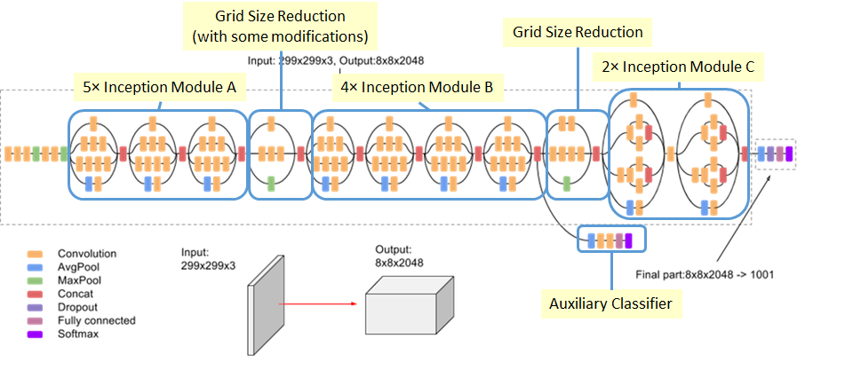

# Ceci n'est pas un chat

Train some CNN models to detect cats and dogs with Keras. Then destroy them with some adversarial examples for the fun of it.

TODO


## How to execute the code

Requirements:

1. If you didn't have yet, [install Conda](https://docs.conda.io/projects/conda/en/latest/user-guide/install/)
2. Clone this repo
3. Create you new conda environment by executing `conda env create` in a command line placed at the root of this repo (this may take some minutes to complete)
4. Activate this new environment with `conda activate ceci-nest-pas-un-chat`
5. Download [Dogs vs. Cats](https://www.kaggle.com/c/dogs-vs-cats/data) and save it as `data/dogs-vs-cats.zip`. You'll have to create an account Kaggle, sorry about that.
6. Execute `python prepare_data.py`. It'll unzip and preprocess the images. At this point, you should have a folder structure like:
    ```
    ceci-nest-pas-un-chat
        +-- data
            +-- training
                +-- cat
                    +-- cat.1.jpg
                    +-- (many other nice photos of cats)
                +-- dog
            +-- validation
                +-- cat
                +-- dog
            +-- test
                +-- cat
                +-- dog
    ```
7. Execute `jupyter notebook` to open the Jupyter HomePage
8. TODO


## Pages

[Clever Hans](https://en.wikipedia.org/wiki/Clever_Hans)

## Images




## Blog posts

- [Review: VGGNet — 1st Runner-Up (Image Classification), Winner (Localization) in ILSVRC 2014](https://medium.com/coinmonks/paper-review-of-vggnet-1st-runner-up-of-ilsvlc-2014-image-classification-d02355543a11)
- [An Overview of ResNet and its Variants](https://towardsdatascience.com/an-overview-of-resnet-and-its-variants-5281e2f56035)
- [Review: ResNet — Winner of ILSVRC 2015 (Image Classification, Localization, Detection)](https://towardsdatascience.com/review-resnet-winner-of-ilsvrc-2015-image-classification-localization-detection-e39402bfa5d8)
- [Review: Inception-v3 — 1st Runner Up (Image Classification) in ILSVRC 2015](https://medium.com/@sh.tsang/review-inception-v3-1st-runner-up-image-classification-in-ilsvrc-2015-17915421f77c)
- [Review: ResNeXt — 1st Runner Up in ILSVRC 2016 (Image Classification)](https://towardsdatascience.com/review-resnext-1st-runner-up-of-ilsvrc-2016-image-classification-15d7f17b42ac)
- [Breaking Linear Classifiers on ImageNet](http://karpathy.github.io/2015/03/30/breaking-convnets/)


## Tutorials

- [Convolutional Neural Networks](https://www.tensorflow.org/beta/tutorials/images/intro_to_cnns)

## Papers

- *ResNext*: K. He, X. Zhang, S. Ren, and J. Sun. Identity Mappings in Deep Residual Networks. 2016. https://arxiv.org/abs/1603.05027
- *VGG*: K. Simonyan, A. Zisserman. Very Deep Convolutional Networks for Large-Scale Image Recognition. 2014, https://arxiv.org/abs/1409.1556

## Example nets

### Simple net

conv2d(32)
maxpool(2)
dense(128)
dense(1)

## TF tutorial

conv2d(32)
maxpool(2)
conv2d(64)
maxpool(2)
conv2d(64)
dense(64)
dense(10)

### VGG16

2x conv2d(64)
maxpool(2)
2x conv2d(128)
maxpool(2)
3x conv2d(256)
maxpool(2)
3x conv2d(512)
maxpool(2)
3x conv2d(512)
maxpool(2)
2x dense(4096)
dense(K)